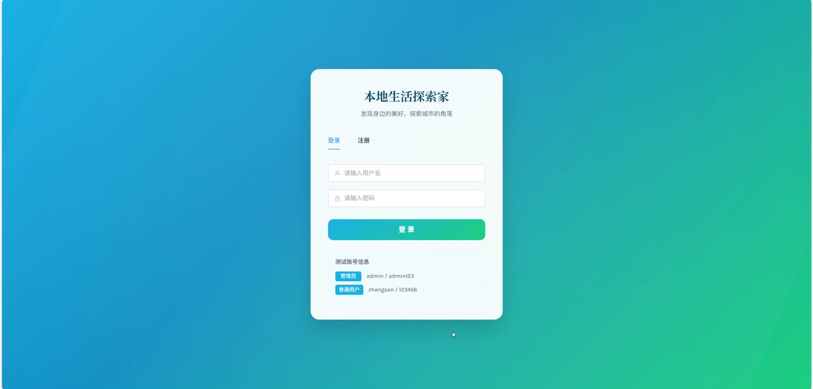
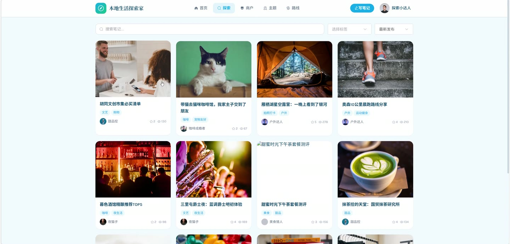
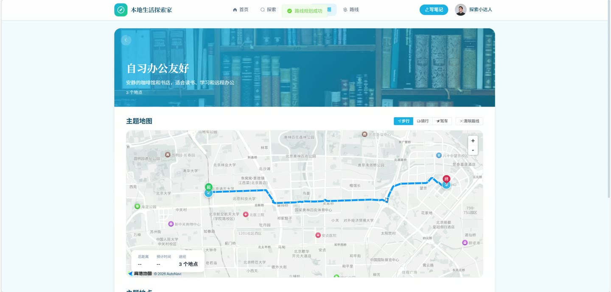
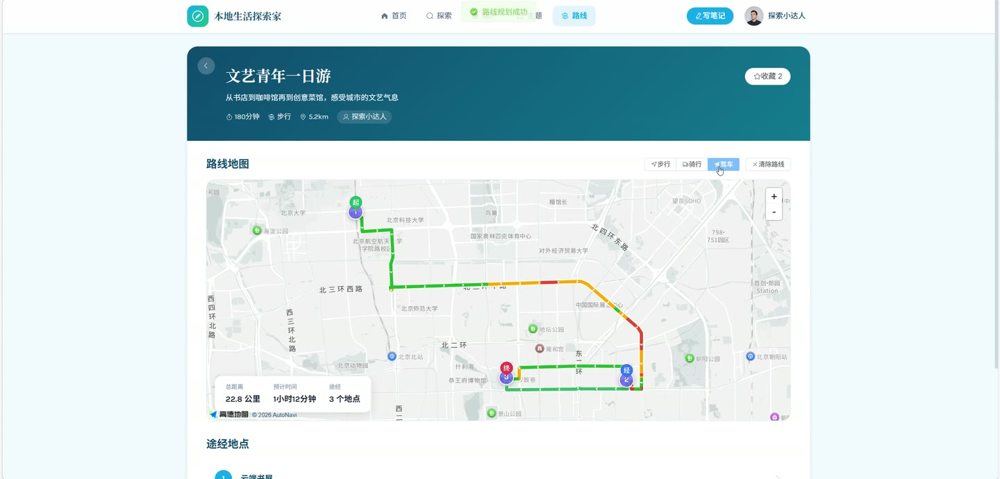

# (附文档)Springboot3+Vue3+MySQL 本地生活探索家系统

**技术栈**：Springboot3、Vue3、MySQL

### 系统简介

本地生活探索家系统是一个基于 Spring Boot 3 + Vue 3 前后端分离的本地生活内容平台。系统支持普通用户与管理员两种角色，用户可发布探店笔记、浏览商户、生成游玩路线，管理员负责内容审核、商户管理、数据统计等后台运营工作。
 
### 核心功能
 
### 普通用户端

 
- 用户注册与登录：支持用户名密码注册登录，登录后自动维护 Session 会话状态 
- 个人信息管理：修改昵称、头像、简介等个人资料；修改登录密码（需验证原密码） 
- 个人主页统计：查看个人发布的笔记数量、收藏数量、关注人数、粉丝数量 
- 关注与粉丝：关注/取消关注其他用户，查看关注列表和粉丝列表 
- 兴趣标签选择：选择感兴趣的标签类别，保存后用于个性化推荐 
- 笔记发布：填写标题、正文、封面图、关联商户，选择标签后提交，发布后进入待审核状态 
- 笔记编辑与删除：修改已发布的笔记内容及标签；删除自己的笔记（逻辑删除） 
- 笔记浏览与搜索：按关键词搜索笔记标题，按标签筛选，支持按时间或热度排序 
- 笔记互动：对笔记进行点赞/取消点赞、收藏/取消收藏操作 
- 笔记举报：对违规笔记提交举报，填写举报原因 
- 我的笔记与收藏：查看自己发布的笔记列表、收藏的笔记列表 
- 关注动态：查看所关注用户发布的笔记动态流 
- 个性化推荐：基于用户兴趣标签推荐相关笔记，不足时以热门笔记补位 
- 商户浏览：按分类或关键词搜索商户列表，按评分降序排列 
- 商户详情：查看商户名称、地址、电话、描述、封面图、图片集、营业时间、分类、经纬度、人均消费、关联标签 
- 附近商户：根据当前经纬度和半径（默认 5 公里）查找附近商户 
- 主题地图：查看主题地图列表（按排序字段升序），每个主题下展示关联的商户集合 
- 主题详情：查看主题名称、描述、封面图、图标、颜色及该主题下的所有商户 
- 路线生成：创建自定义游玩路线，系统保存路线信息 
- 路线收藏：收藏/取消收藏他人发布的路线，查看自己的路线收藏列表 
- 我的路线：查看自己创建的路线列表 
- 浏览历史：自动记录用户浏览过的笔记和商户，支持清空历史记录 
- 文件上传：支持上传图片文件，返回可访问的 URL 路径
 
### 管理员后台

 
- 用户管理：分页查看普通用户列表（支持按用户名/昵称/手机号搜索），启用或禁用用户账号 
- 笔记审核：分页查看待审核/已通过/已拒绝的笔记列表，审核通过或拒绝并填写审核备注 
- 笔记删除：管理员强制删除违规笔记（状态标记为已删除） 
- 商户管理：分页查看商户列表（支持关键词和分类筛选），添加新商户（填写名称、地址、电话、描述、封面、图片、营业时间、分类、经纬度、人均消费，关联标签） 
- 商户编辑与删除：修改商户全部信息及关联标签；删除商户（逻辑禁用，状态置为 0） 
- 标签管理：按类型筛选标签列表，添加、修改、删除标签（名称、类型、排序） 
- 主题地图管理：分页查看主题列表（支持关键词搜索），添加主题（名称、描述、封面图、图标、颜色、排序，关联商户） 
- 主题编辑与删除：修改主题信息及关联商户；删除主题 
- 举报管理：分页查看用户举报记录（按处理状态筛选），处理举报（通过或驳回，填写处理备注） 
- 数据统计：查看总笔记数、待审核笔记数、总用户数、总商户数、今日新增笔记数 
- 系统日志：分页查看系统操作日志（支持按操作内容或用户名关键词搜索）
 
### 技术栈

  后端框架 Spring Boot 3   ORM MyBatis-Plus   权限控制 基于 HttpSession 的角色校验   前端框架 Vue 3   状态管理 Vuex / Pinia   构建工具 Vite   数据库 MySQL 
 
### 交付内容

 
- 后端完整源码 
- 前端完整源码 
- 数据库初始化脚本 
- 万字文档

## 界面展示

---

## 获取完整源码 + 万字文档

本仓库为项目介绍页。**完整前后端源码、数据库初始化脚本、万字项目文档**，请访问 [codekk.top](http://codekk.top) 获取。

可作课程设计 / 毕业设计参考，支持远程部署调试。